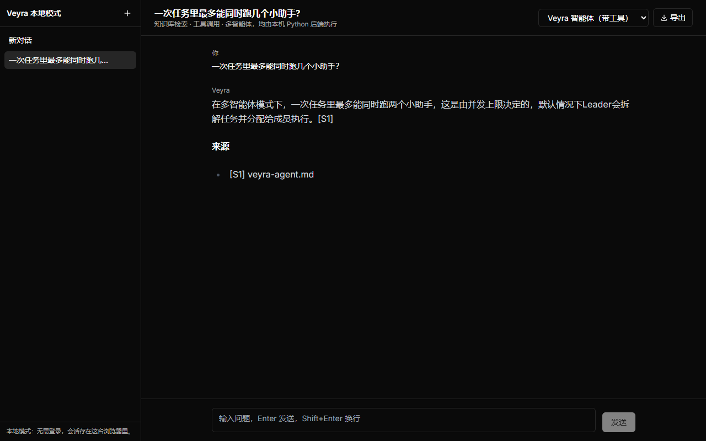
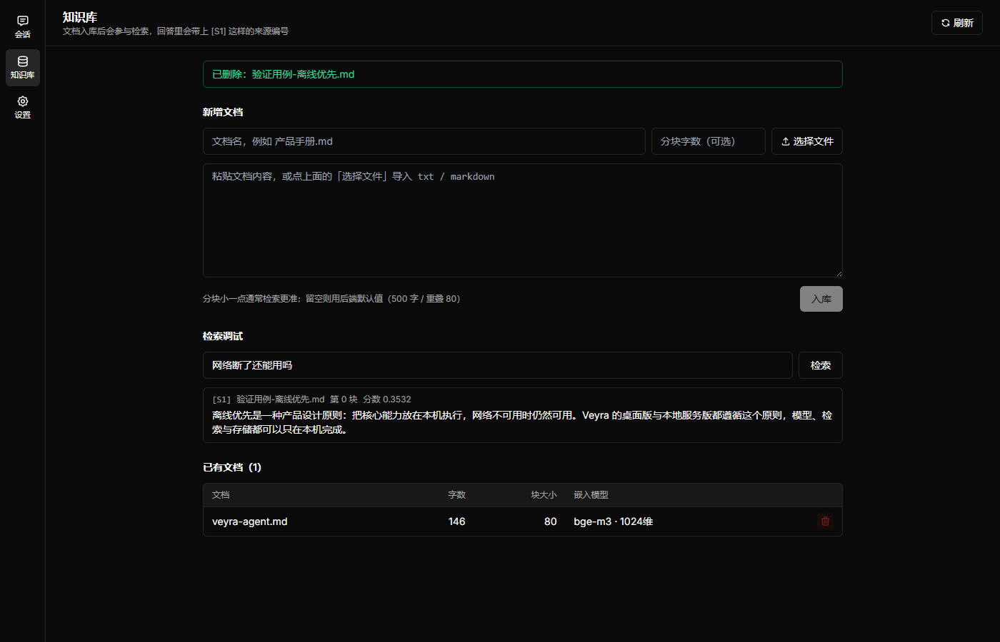
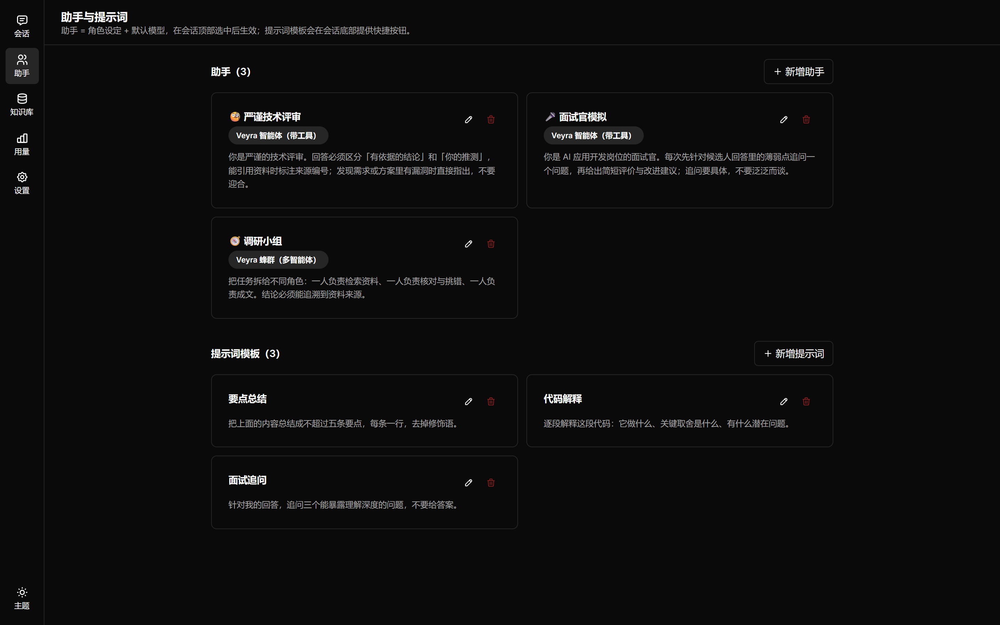
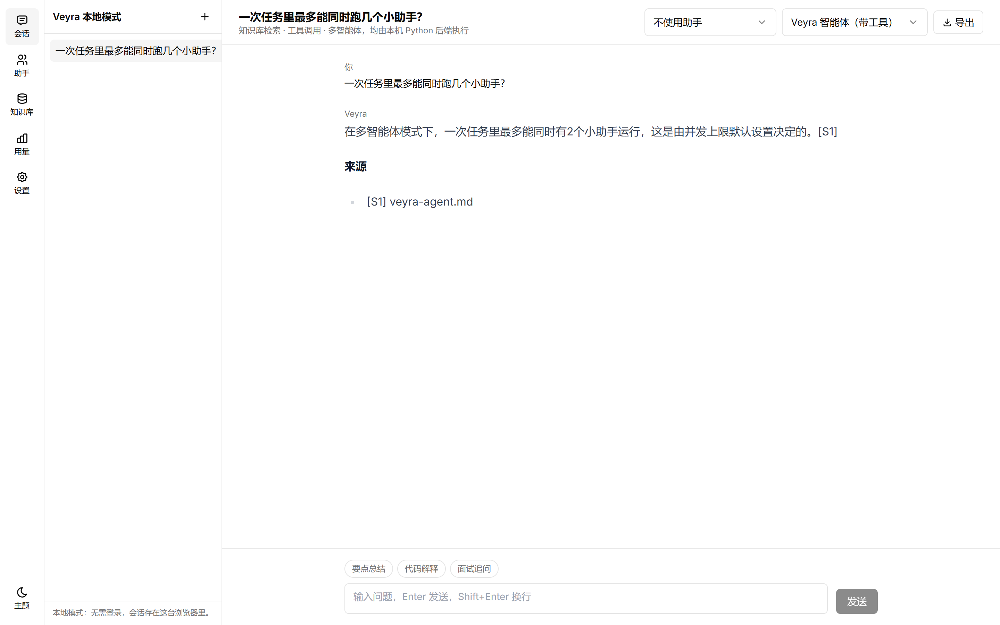
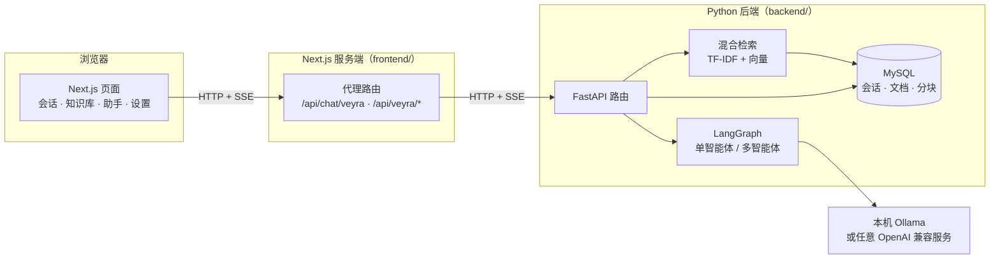

<div align="center">

# Veyra

**本地优先的 AI 应用全栈实现**

Next.js 前端 · FastAPI + LangGraph 后端 · 知识库检索 · 多智能体协作

<br />

[](https://github.com/xiaopeng-126/veyra-app/actions/workflows/ci.yml)


<br />

[概览](#概览) · [界面](#界面) · [架构](#系统架构) · [快速开始](#快速开始) · [接口](#接口一览) · [设计取舍](#关键设计取舍) · [测试](#测试与-ci)

</div>

---

## 概览

Veyra 是一个可以完全跑在自己电脑上的 AI 应用：前端是聊天界面，后端负责模型调用、知识库检索与
Agent 编排。数据、密钥与对话记录都留在本机，不依赖任何第三方后端服务。

它解决的是「把 RAG 与 Agent 真正落地」时会遇到的那几个具体问题：
检索命中率怎么量化、换嵌入模型怎么不静默变差、模型卡住怎么办、上下文超长怎么裁、
多智能体怎么调度而不失控。每个问题在下面都有对应的实现与测试。

<table>
  <tr>
    <td width="25%" align="center"><strong>本地优先</strong><br /><sub>对话、知识库、密钥都在本机</sub></td>
    <td width="25%" align="center"><strong>模型无锁定</strong><br /><sub>Ollama / DeepSeek / 任意兼容服务</sub></td>
    <td width="25%" align="center"><strong>Agent 原生</strong><br /><sub>工具调用循环与多智能体调度</sub></td>
    <td width="25%" align="center"><strong>可追溯</strong><br /><sub>回答带来源编号，用量可查</sub></td>
  </tr>
</table>

## 界面

<table>
  <tr>
    <td width="50%">
      
      <p align="center"><sub><b>会话</b>：流式回答、来源引用、多会话管理</sub></p>
    </td>
    <td width="50%">
      
      <p align="center"><sub><b>知识库</b>：拖拽入库、名称搜索、列排序、检索调试</sub></p>
    </td>
  </tr>
  <tr>
    <td width="50%">
      
      <p align="center"><sub><b>助手与提示词</b>：卡片管理、弹窗编辑</sub></p>
    </td>
    <td width="50%">
      
      <p align="center"><sub><b>用量</b>：按模型与日期聚合 token 消耗</sub></p>
    </td>
  </tr>
</table>

界面基于 Tailwind + shadcn/ui（Radix 无障碍原语）构建。

主题支持**亮色 / 暗色 / 跟随系统**三选一（设置 → 外观），导航栏底部的按钮用于快速切换：

<p align="center">
  
</p>

### 快捷键

| 快捷键 | 作用 |
| --- | --- |
| `⌘/Ctrl + K` | 命令面板：搜索会话、跳转页面、新建会话 |
| `⌘/Ctrl + N` | 新建会话 |
| `Esc` | 关闭命令面板与确认弹窗 |

消息支持悬停操作：复制，以及用同一个提问**重新生成**回答。

## 核心能力

| 模块 | 能力 | 实现位置 |
| --- | --- | --- |
| 跨模型对话 | SSE 流式输出、会话内切换模型、缺密钥自动降级到离线 mock | `backend/app/llm/` |
| Agent 工具调用 | 模型自主决定调用工具，循环有步数上限与整体超时 | `backend/app/agent/graph.py` |
| 多智能体协作 | Leader 规划 → 依赖感知并发调度 → 汇总，成员失败不影响其他成员 | `backend/app/agent/swarm.py` |
| 知识库 RAG | 分块入库、名称搜索与排序、混合检索（TF-IDF + 向量）、回答带 `[S1]` 来源编号 | `backend/app/kb/` |
| 助手与提示词 | 角色设定与可复用指令模板，选中后作为系统提示词下发 | `frontend/app/local/assistants/` |
| 会话与用量 | 会话、消息、token 用量落 MySQL，Alembic 管理迁移 | `backend/app/db/` |
| 用量统计 | 按模型与日期聚合 token 用量并可视化 | `backend/app/api/routes/usage.py` |
| 接口安全 | API Key 鉴权 + 按 key 的滑动窗口限流 | `backend/app/api/deps.py` |

## 系统架构



### 目录结构

```
veyra/
├── frontend/                     Next.js 14（App Router）
│   ├── app/
│   │   ├── local/                本地模式四页：会话 / 助手 / 知识库 / 设置
│   │   └── api/                  代理到 Python 后端的路由
│   └── lib/
│       ├── local-chat/           会话、助手、设置的本地存储
│       └── veyra-backend.ts      后端地址解析（仅允许本机地址）
└── backend/                      FastAPI + LangGraph
    ├── app/
    │   ├── api/routes/           health / sessions / kb / chat
    │   ├── agent/                LangGraph 图、工具注册表、多智能体编排
    │   ├── kb/                   分块、向量化、混合检索
    │   ├── llm/                  模型抽象（mock / OpenAI 兼容）
    │   └── db/                   SQLAlchemy 模型与会话工厂
    ├── migrations/               Alembic 迁移
    └── scripts/                  冒烟脚本、检索评估、阈值校准
```

## 快速开始

前端与后端各自独立，先起后端再起前端。

### 后端

```powershell
cd backend
python -m venv .venv
.\.venv\Scripts\python.exe -m pip install -r requirements.txt

# 建库（本地 MySQL）
mysql -u root -e "CREATE DATABASE IF NOT EXISTS veyra CHARACTER SET utf8mb4;"
copy .env.example .env

.\.venv\Scripts\python.exe -m alembic upgrade head
.\.venv\Scripts\python.exe -m uvicorn app.main:app --reload
```

打开 <http://127.0.0.1:8000/docs> 可以直接调接口。默认使用离线 mock 模型，**不需要任何密钥**就能跑通。

接本机 Ollama 的真实模型与中文嵌入：

```env
LLM_PROVIDER=openai_compat
LLM_BASE_URL=http://127.0.0.1:11434/v1
LLM_MODEL=qwen2.5
EMBEDDING_PROVIDER=openai_compat
EMBEDDING_MODEL=bge-m3
EMBEDDING_DIM=1024
```

> 部署到服务器时记得配置 `API_KEYS`：留空等于不校验，任何能连上端口的人都能用。

### 前端

```powershell
cd frontend
npm install
copy .env.local.example .env.local
npm run dev
```

打开 <http://localhost:3000/local> 直接提问，不需要登录，也不会向外部服务发送任何数据。

## 接口一览

| 方法 | 路径 | 说明 |
| --- | --- | --- |
| GET | `/health` | 健康检查（含数据库探活，不需要鉴权） |
| POST | `/chat` | 对话，一次性返回 |
| POST | `/chat/stream` | 对话，SSE 流式返回 |
| POST | `/sessions` | 建立会话 |
| GET | `/sessions/{id}/messages` | 会话消息列表 |
| POST | `/kb/documents` | 文档入库（自动分块 + 向量化，幂等） |
| GET | `/kb/documents` | 文档列表（含分块大小与嵌入模型） |
| DELETE | `/kb/documents/{id}` | 删除文档及其分块 |
| POST | `/kb/search` | 知识库检索，返回带编号与分数的片段 |
| GET | `/usage` | 用量统计（按模型与日期聚合） |

`POST /chat` 支持的关键参数：

```json
{
  "message": "一次任务里最多能同时跑几个小助手？",
  "mode": "single",
  "use_knowledge": true,
  "system_prompt": "你是严谨的技术评审，区分结论与推测",
  "max_steps": 8
}
```

## 关键设计取舍

这些是写这个项目时真正花时间做判断的地方，也是面试里最容易被追问的点。

### 检索：混合打分 + 用实测校准的阈值

只用向量检索，遇到专有名词和短查询容易跑偏；只用关键词，同义改写就召不回。所以两个都算再加权求和，
并用「词法覆盖率 **或** 向量相似度」作为放行条件——这两道门槛必须是**或**的关系，
否则「对话记录存在哪里」这种和原文用词完全不同的问法会被纯词法门槛挡掉。

阈值不靠拍脑袋：`scripts/evaluate_retrieval.py --sweep` 会在带标注的数据集上跑 100+ 种组合，
把召回、MRR、误召回一起打出来。实测对比：

| 嵌入方式 | recall@3 | MRR | 误召回率 |
| --- | --- | --- | --- |
| hash（无语义，离线基线） | 87.5% | 0.750 | 50% |
| bge-m3（真实语义） | **100%** | **1.000** | **0%** |

在 hash 基线那一列，我把所有阈值组合都扫了一遍，**没有任何一组**能同时做到高召回和零误召回——
这说明瓶颈在嵌入本身，继续调阈值只是在两个糟糕的选项里挑一个。

### 分块比阈值更值得先查

同样是实测发现的问题：一篇 146 字、讲了三个主题的文档，如果被切成**一整块**，
工具调用、并发限制、数据库三件事会被平均进同一个向量，相关片段聊胜于无、无关片段也没被拉开。
按 80 字切成三块之后，**同一套阈值**下三个相关问题全部命中，无关问题依然被拒绝。

所以调优顺序是：先看分块有没有把主题混在一起 → 再看嵌入模型有没有语义 → 最后才动阈值。

### 换嵌入模型不能静默变差

向量维度对不上时，余弦相似度会直接返回 0——不报错、不警告，日志里什么都看不到。
所以 `documents` 表记录了入库时的 `embedding_model` / `embedding_dim` / `chunk_size`，
检索时发现维度不一致就跳过这些分块并打出警告。**换嵌入模型 = 重建索引**，这是基本纪律。

### 异步接口里的同步数据库调用

FastAPI 的 `async def` 路由跑在事件循环里，而 SQLAlchemy 同步驱动是阻塞的。
在 `async def` 里直接 `db.execute(...)`，会把整个事件循环卡住——单机自测完全看不出来。
所以知识库读写与对话落库都走 `run_in_threadpool`，并有测试用 0.3 秒假慢查询 + 心跳协程验证。

### 模型卡住与上下文超长

单轮对话有整体超时，超时**不是**返回 500，而是保留已生成的部分并说明情况——
用户至少知道自己看的是半截答案。上下文裁剪按 token 预算而不是按条数：三条长文档和三十条短消息
的 token 量差着数量级，按条数裁一样会把上下文撑爆；裁剪时无论如何保留最新一条。

### 多智能体：模型给的计划不能直接信

Leader 输出 JSON 计划后要过三道关：id 唯一、依赖存在、不能成环，成员数有上限；
解析失败就降级成单任务，绝不让坏计划把整轮对话带崩。执行阶段用信号量限制并发、每个成员有超时，
某个成员失败时依赖它的下游标记为跳过，其余照常汇总。

### 代理只允许连本机后端

前端通过 Next 的服务端路由转发请求，避免跨域并隐藏密钥。后端地址可以从设置页配置，
但**只接受 127.0.0.1 / localhost**——否则这个代理就成了一个 SSRF 跳板，任何网站都能借它探测内网。

### 向量检索：先量规模，再决定要不要上 ANN

知识库检索现在是全量余弦（精确、无需额外组件），向量部分用 numpy 批量计算。
什么时候该换成真正的向量索引？与其拍脑袋，不如量一遍：

```powershell
.\.venv\Scripts\python.exe scripts\benchmark_retrieval.py --sizes 200,1000,5000
```

1024 维、Top-6、单机实测（中位数）：

| 分块数 | 纯 Python 逐条 | numpy 批量 | rank_chunks 全流程 |
| --- | --- | --- | --- |
| 200 | 40 ms | 12 ms | 52 ms |
| 1000 | 215 ms | 47 ms | 187 ms |
| 5000 | 1121 ms | 217 ms | 857 ms |

结论：**一千块以内全量余弦完全够用；到五千块、全流程接近 1 秒时，才值得引入 ANN**。
所以 Roadmap 里的向量索引不是不做，而是等知识库真的长到那个规模再做——
现在加，只是给项目增加一个需要维护的组件。

### 多实例部署的限流

限流有两套实现，接口一致（`check(key, limit) -> (是否放行, 等待秒数)`）：

- 默认：进程内滑动窗口，零依赖，适合单机
- 配了 `REDIS_URL`：Redis 有序集合实现的滑动窗口，多个实例共享同一份计数

装配时会先 `ping()` 一次 Redis：`from_url()` 只是解析地址、并不会真的连接，
不探测的话配错地址要等到第一个请求才炸。连不上就退回进程内实现并打告警。
运行期如果 Redis 抖动，限流器故障会让请求**放行**并记录告警——可用性优先于限流严格性。

## 测试与 CI

```powershell
# 后端：64 项，离线可跑（SQLite + mock 模型）
cd backend
.\.venv\Scripts\python.exe -m pytest -q
.\.venv\Scripts\ruff.exe check app tests scripts
.\.venv\Scripts\python.exe -m alembic check

# 检索质量门禁：召回下降或误召回上升会以非零码退出
.\.venv\Scripts\python.exe scripts\evaluate_retrieval.py --embedding hash --min-recall 0.85

# 前端：类型检查、lint、7 项单测
cd frontend
npm run type-check && npm run lint && npm test && npm run build

# 浏览器 E2E：自动拉起 mock 后端 + SQLite，不依赖 Ollama 或 MySQL
npx playwright install chromium
npm run test:e2e
```

CI（`.github/workflows/ci.yml`）在每次推送时跑三个 job：

| Job | 内容 |
| --- | --- |
| 后端 | ruff + pytest + **检索评估回归门禁** + 在真实 MySQL 8.4 容器上跑迁移与一致性校验 |
| 前端 | 类型检查 + lint + 单测 + Playwright 浏览器 E2E |
| 容器 | 校验 compose 配置并**真构建镜像** |

## Roadmap

- [x] 跨模型流式对话与会话管理
- [x] 知识库：分块、混合检索、来源引用、幂等入库
- [x] Agent 工具调用循环与多智能体协作
- [x] 助手、提示词模板与参数设置
- [x] 鉴权、限流、迁移与 CI
- [ ] PDF / DOCX 文档解析
- [x] PDF / DOCX 文档解析（含表格抽取与可读的失败原因）
- [x] 原生 function calling（自动在原生协议与 JSON 兜底之间切换）
- [x] 多实例部署的 Redis 限流（配 `REDIS_URL` 即启用）
- [ ] 向量索引：实测全量余弦在 1000 块以内够用、5000 块约 0.9 秒，等规模上来再引入 ANN

## 许可

本项目采用 MIT 许可（见 [LICENSE](LICENSE)）。

前端界面基于开源项目 [chatbot-ui](https://github.com/mckaywrigley/chatbot-ui) 改造，
其原有 MIT 许可与版权声明保留在 `frontend/license`。
